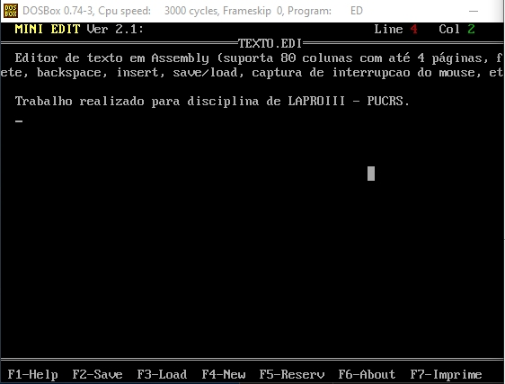
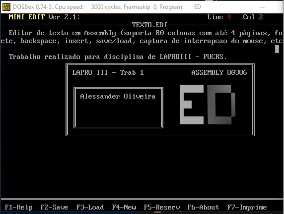
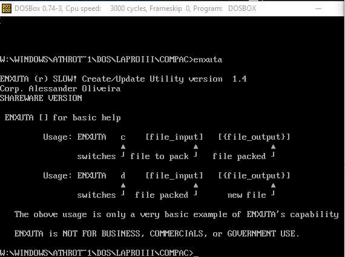
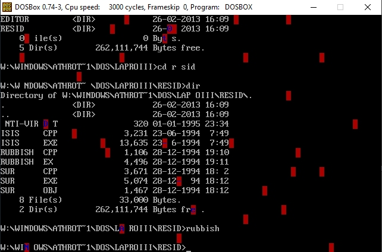
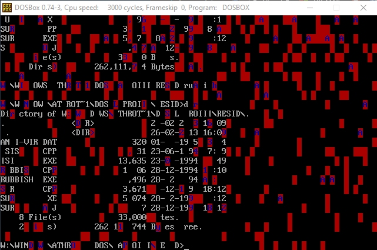

# LAPROIII - by Aless

This is a repository with old programs developed in the discipline of Programming Laboratory III (LAPROIII) studied at PUC-RS, in the 90s, with professor Márcio S. Pinho.

The course was focused on programming Language ASSEMBLY 80386 and C.

# Three works were requested and developed at the time:

<table width:100%>
  <tr><td colspan=3>1) A text editor (something equivalent to the old DOS Edit) that supports at least four pages, mouse and some basic functions for saving, etc. <b>[EDIT]</b></td></tr>
  <tr>
    <td></td>
    <td></td>
    <td></td>
  </tr>
  <tr><td colspan=3>2) A file compactor with the least amount of code possible and according to the content seen so far. <b>[ENXUTA]</b></td></tr>
  <tr>
    <td></td>
    <td></td>
    <td></td>
  </tr>
  <tr><td colspan=3>3) A simplified "resident" program (study on virus architecture). <b>[RUBBISH]</b></td></tr>
  <tr>
    <td></td>
    <td></td>
    <td></td>
  </tr>
</table>

All files ".exe" should be run well on a DOSBox (in fact that was the way I got these screenshots above).
